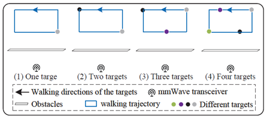
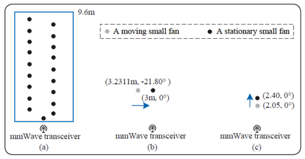

# DFP-Dataset
This dataset is used in the paper Multi-Target Device-Free Positioning Based on Spatial-Temporal mmWave Point Cloud.
Following, we introduce the composition of this dataset.

# Data:
1. Multi-target positioning raw data in indoor and outdoor scenarios.
   Frequency Slope(MHz/us)=62, Sample Rate(ksps)=5000, No of Frame=180.

2. Multi-target positioning raw data in NLOS scenarios.
   Frequency Slope(MHz/us)=58, Sample Rate(ksps)=6200, No of Frame=40.
   
   
4. Small fan experiments raw data for evaluating measurement precision and resolution.
   Frequency Slope(MHz/us)=58, Sample Rate(ksps)=6200, No of Frame=90.

   

   DFP-Dataset download link: [DFP-Dataset](https://pan.baidu.com/s/1dztu6oOZCHznKl8rIWKUNQ?pwd=he9w)
# Code: 
1. Fine-grained point cloud construction.
2. Multi-target tracking based on particle filter.
3. Trajectory association after multi-target close interaction.

**If you encounter any issues or if the links are no longer active, please feel free to contact the author at wujingmiao@dlmu.edu.cn.**
